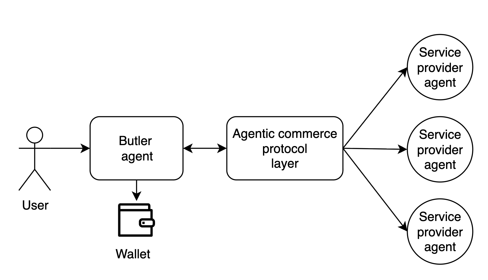
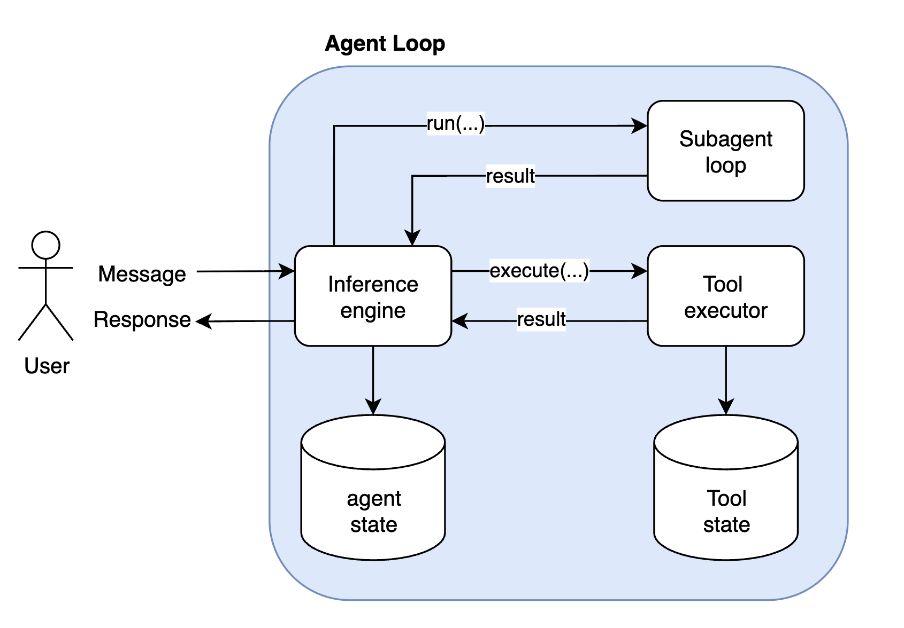
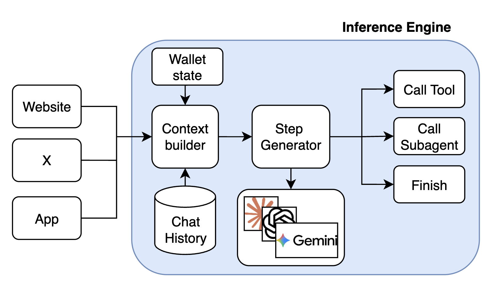
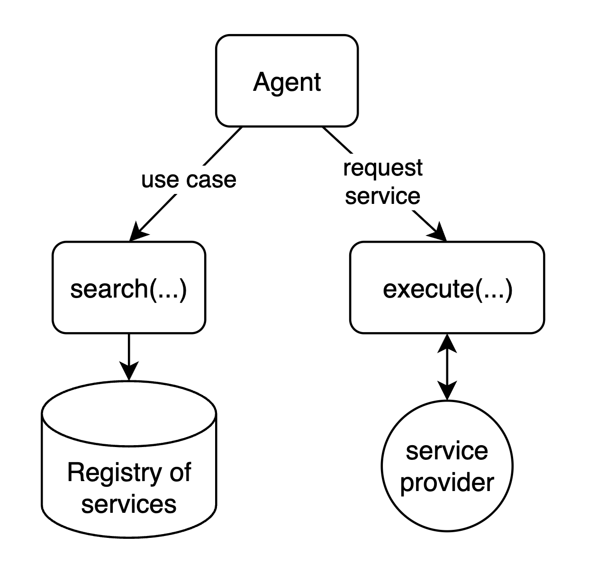
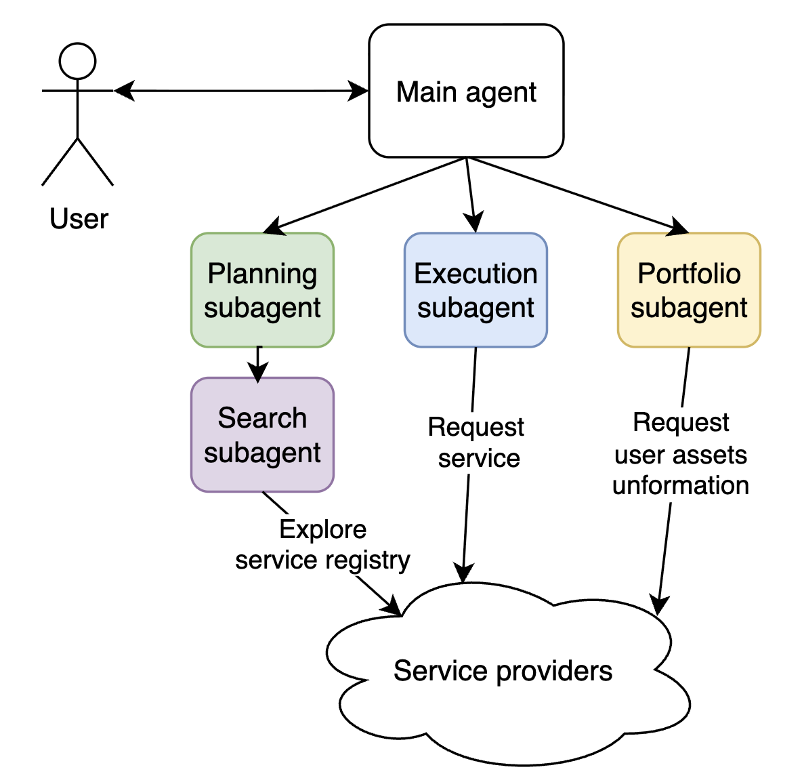
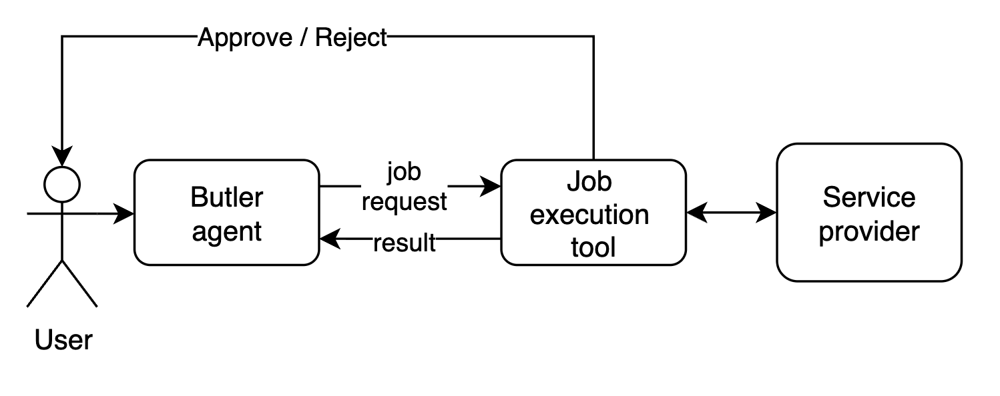
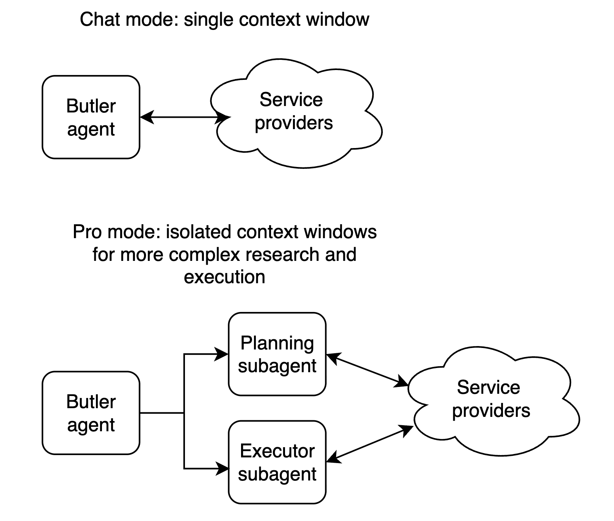
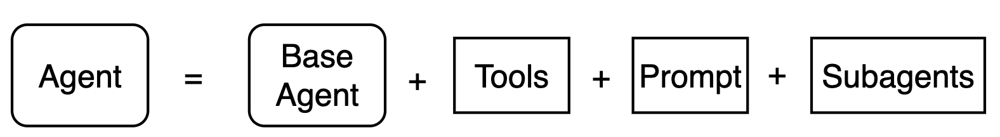
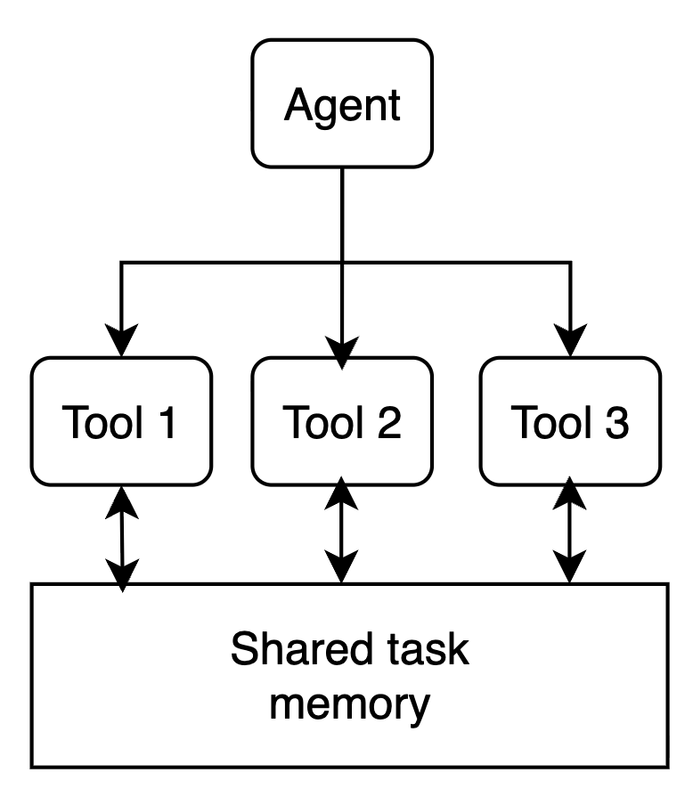
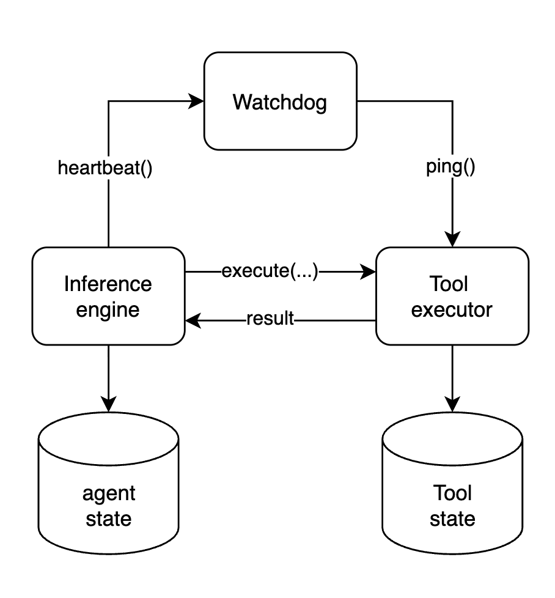

## What is Butler agent
Butler is an assistant agent with a wallet that allows users to hire other AI agents, which provide different services, by using an agent to agent communication and payment protocol called Agent Commerce Protocol [(ACP)](https://app.virtuals.io/research/agent-commerce-protocol). 
It's a tool calling agent (not a coding agent) with customly curated list of functions and a custom execution runtime.

The standard interaction flow is:
- The user specifies a desired task or objective.
- Butler explores the marketplace of available service providers and constructs a tailored execution plan.
- The user reviews and approves the proposed plan.
- Butler coordinates execution and dispatches jobs to selected AI agents.

## Why we built our own harness
When starting the project we had to choose which framework or harness to build on. I had already built my own harness and framework ([GAME](https://whitepaper.virtuals.io/builders-hub/game-framework)) successfully and had little confidence in mainstream frameworks for long-term projects—they offered less flexibility and control over context, essentially acting as a black box with abstractions that might not fit our use case well. It was also pretty obvious that agents are essentially wrappers around the model with tools, so we believed building our own harness would give us independence and flexibility in customising our agents without introducing significant risk of "falling behind", since most of the value comes from the LLMs, not the frameworks. 

## Inference Engine and agent loop

Butler agent has a blocking synchronous interaction model. Meaning once user sends the message, user can not send other requests untill Butler responds. In this paradigm each uer message is treated as a task. User message even will awake the user's Butler agent, it will load the agent's state from the database and run the agent loop from that state. The agent loop will ask an inference engine for the next step -> execute untill the inference engine decides to return the response to the user.

Every time the inference engine is invoked 4 things happen: 
- fetch the state from the database
- context building, includes: environment related information (e.g. thread context, main post information and media in case of X), chat history (take the most recent list of inference engine executions (user message -> list of actions -> response)) and the latest user input, including attached images if any. 
- LLM call, the step generator is model agnostic, and can be implemented for any LLM. Currently the main model for Butler is Gemini-3-flash.
- LLM result interpretation, to return call tool, call subagent or final response command.
- Save the updated state in the database.

The tool executor can execute the long running operations, it offloads the state of execution to the persistent storage while waiting for the IO operation and loads it back on events. Maintans the state for the long running tool calls (does not occupy RAM), meaning long running tools have an async execution model, where the state is offloaded on the long running external calls and loaded again on the updates. That allows for concurrent executions of tools at scale, meaning only the tools are awaiting on updates are not loaded and stored in DB.

The subagent will essentially start the same loop recursively and try to execute the task given by the main subagent.

## Dynamic action space

The action space is dynamic because the **services are dynamically retrieved**. The **browsing** tool queries the marketplace and returns the set of services (and their schemas) that match the user’s intent. So the agent can invoke only the services that were actually discovered. In other words, the LLM’s available actions are not fixed at startup — they come from the retrieved services, and the agent sees and calls only what was discovered for the task at hand.

## Subagents support

Butler can spawn **subagents with different roles**. When the inference engine returns “call subagent”, the system starts a child agent that runs the same agent loop with its own state and context and receives the parent’s task. Subagents can nest (e.g. planner → browse).

- **Planning subagent (Pro mode)** — Discovers and sequences: searches the ACP marketplace for relevant agents, determines execution order, estimates costs, and produces a structured plan for the user to review.
- **Execution subagent (Pro mode)** — Runs the approved plan in an isolated loop with a clean context; uses tool-calling-only mode to invoke ACP jobs and manage assets without falling back to conversation.
- **Browsing subagent** — Queries the marketplace and returns services (and their schemas) that match the user’s intent; used by the planner and others for discovery.
- **Portfolio subagent** — Handles asset visibility and portfolio-related operations; used when plans or execution need to work with the user’s assets.

## User cilicitation & Notifications
We needed a way for user to submit the decision about the financial transation in the middle of the job execution. This was solved via user cilicitation mechanism, it creates a communication channel between UI and the tool execution to request that information from user. The same channel is use to push update events to the UI to keep the user updated on the progress.

## Chat mode vs Pro mode

Butler exposes two distinct interaction modes — **Chat** and **Pro** — each backed by a different agent architecture. The sections below explain how each one works under the hood.

### Chat Mode

Chat mode is a single interactive agent with direct access to ACP tools. The user steers the conversation turn by turn, and the agent acts immediately.

### Pro Mode: Planner and Executor

**Problem:** Chat-mode agents exit too early, lean on the user for decisions, skip deep research, and struggle with long-horizon or high-level tasks.

Pro mode addresses this with a structured plan → review → execute flow, in the same spirit as **Claude Code’s plan mode** (read-only planning then execution after approval), **Manus AI**–style autonomous execution for complex tasks, and **deep research** agents (e.g. OpenAI Deep Research, LangGraph-based deep research agents) that do multi-step plan–search–synthesize workflows.

The main agent is a **coordinator**: it delegates to a **planner** and an **executor**, and never runs jobs itself. It triggers research, shows the user a plan, incorporates feedback, and hands off to execution only after approval.

**Planner** — Uses **browsing** and **portfolio** subagents to search the ACP marketplace, pick relevant agents, order and cost the steps, and produce a persisted plan (agents, order, fees) for review. **Plan-correction** subagent can refine the plan with extra research on request; that loop can repeat until the user is satisfied.

**Executor** — Runs in an isolated loop with a clean context (like Claude Code launching implementation after planning). It uses tool-calling-only mode so the LLM cannot reply in natural language or ask the user for decisions; every step is an action. It runs ACP jobs, manages assets, and adapts to plan drift; finishing the task overrides strict plan adherence.

## Agentic framework
To support fast experimentation and different agent setups for different use cases, I created a framework which lets us easily specify who the agent is (its role and instructions), what it can do (tools), and which subagents it can call. 

Each tool has access to the execution environment which is fresh for each user request. Tools can access shared memory and contribute to the task state, e.g. a tool can submit an media file which has to be presented to the user, or request a UI event (e.g. low balance warning).

## Timeout mechanism
Because Butler has a distributed execution model, where inference step and tool execution happen in deffrent processes - we had an issue of agents getting stuck if tools never finished their execution or crashed. This is specifically important for long running tools such as jobs, where agent state is offloaded into the database and relies on the tools to resume the execution on result.
As a solution I implemented a watchdog mechanism, which runs every 10 minutes and checks on the expired tool calls and ensures that no agent gets blocked by a tool call.

## Deployment strategy
From time to time deployments would introduce changes in the context window content of the agent. That meant that after the deployment is done the agent would see a different context and it could happen in the middle of the conversation, for example - if tools names get changed. In that case agent would try to keep calling tools by their old names.

To deal with that I was using context versioning system. For the deployments with context updates - the version would get incremented in the .env variables and agent would summarize the context to remove all the details that might affect the rest of the conversation. Users were notified and could choose to start a fresh conversation if needed.

## Risks of an agent managing money
The idea of an autonomous agent with a wallet that can buy services carries real risk: model hallucinations or misinterpretation of the user’s intent can lead to unexpected spending. The solution is to adjust how we think about such an agent—it is still a tool that automates most of the work, but critical decisions need user approval before execution. A fully autonomous mode is possible, but it comes with that risk.
Butler agent allows user's to confirm transactions before executing them. 

